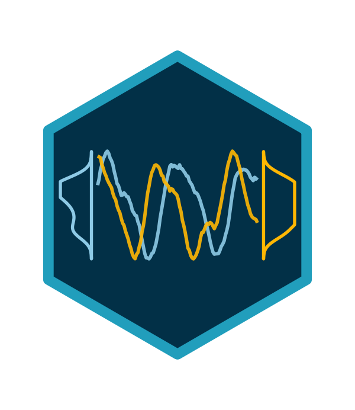

# dcvar: Dynamic Copula VAR Models for Time-Varying Dependence

[](https://github.com/benlug/dcvar)

<!-- badges: start -->
[](https://github.com/benlug/dcvar/actions/workflows/R-CMD-check.yaml)
[](https://lifecycle.r-lib.org/articles/stages.html#experimental)
[](https://www.gnu.org/licenses/gpl-3.0.en.html)
<!-- badges: end -->

`dcvar` is an R package for fitting Bayesian Gaussian-copula VAR(1) models to
bivariate time series. Its core scope is the single-level Gaussian-copula
family: continuous random-walk, regime-switching, and constant-copula
specifications, all estimated through [Stan](https://mc-stan.org/). The
package also ships experimental multilevel and SEM extensions.

## Installation

`dcvar` uses [`rstan`](https://mc-stan.org/rstan/) as its default backend.

Install `rstan` and `dcvar`:

```r
install.packages("rstan")

install.packages("remotes")
remotes::install_github("benlug/dcvar")
```

Optionally, you can use [`cmdstanr`](https://mc-stan.org/cmdstanr/) as an
alternative backend:

```r
install.packages(
  "cmdstanr",
  repos = c("https://stan-dev.r-universe.dev", getOption("repos"))
)
cmdstanr::install_cmdstan()
```

CI includes a dedicated Ubuntu release lane that runs the `backend = "cmdstanr"`
regression tests when both `cmdstanr` and CmdStan are available.

For skew-normal margins, install `sn`:

```r
install.packages("sn")
```

## Example

The example below simulates a bivariate time series with decreasing
dependence, fits the baseline DC-VAR model, and compares it to HMM and
constant-copula alternatives.

```r
library(dcvar)

# simulate data with decreasing coupling
sim <- simulate_dcvar(
  T = 150,
  rho_trajectory = rho_decreasing(150, rho_start = 0.7, rho_end = 0.3)
)

# fit the DC-VAR model
fit <- dcvar(sim$Y_df, vars = c("y1", "y2"))

# inspect results
summary(fit)
plot_rho(fit, true_rho = sim$true_params$rho)

# compare models via LOO-CV
fit_hmm <- dcvar_hmm(sim$Y_df, vars = c("y1", "y2"), K = 2)
fit_con <- dcvar_constant(sim$Y_df, vars = c("y1", "y2"))
dcvar_compare(dcvar = fit, hmm = fit_hmm, constant = fit_con)
```

## Supported Models

| Model | Function | Dependence Structure | Status |
| --- | --- | --- | --- |
| **DC-VAR** | `dcvar()` | Continuous random-walk on Fisher-z scale | Core |
| **HMM Copula** | `dcvar_hmm()` | Discrete regime-switching with K states | Core |
| **Constant Copula** | `dcvar_constant()` | Time-invariant baseline | Core |
| **Multilevel** | `dcvar_multilevel()` | Random VAR coefficients for panel data | Experimental |
| **SEM** | `dcvar_sem()` | Fixed measurement model for latent processes | Experimental |

All models use Gaussian copulas. The core three time-series models
(`dcvar()`, `dcvar_hmm()`, and `dcvar_constant()`) support four marginal
distributions: **normal**, **exponential**, **skew-normal**, and **gamma**.
The multilevel variant currently supports normal margins only. The SEM variant
supports normal and exponential latent innovation margins.

If you are reading the accompanying manuscript, note that `dcvar` currently
implements Gaussian-copula workflows only. Clayton-copula models are not part
of the package.

`fitted()` and `predict()` are implemented for all five fit classes. The
multilevel methods return unit-specific trajectories and intervals; the SEM
methods support both latent-state (`type = "link"`) and indicator-scale
(`type = "response"`) summaries. `pit_values()`, `pit_test()`, and `loo()`
currently support the three core single-level models only. `plot_ppc()` is
available for normal and exponential margins; gamma and skew-normal fits do
not yet have replicated residuals on the observed margin scale.

`pit_values()` and `pit_test()` are approximate residual diagnostics based on
posterior means. They are useful as heuristic checks, not exact posterior
predictive calibration tests.

## Documentation

- Getting started vignette: [vignettes/getting-started.Rmd](vignettes/getting-started.Rmd)
- Model comparison vignette: [vignettes/model-comparison.Rmd](vignettes/model-comparison.Rmd)
- Simulation tools vignette: [vignettes/simulation-tools.Rmd](vignettes/simulation-tools.Rmd)
- Full Quarto walkthrough: [vignettes/dcvar-walkthrough.qmd](https://github.com/benlug/dcvar/blob/main/vignettes/dcvar-walkthrough.qmd)
- Source code and issue tracker: <https://github.com/benlug/dcvar>

## Citation

If you use `dcvar` in your work, cite it with:

```r
citation("dcvar")
```

## Getting Help

- Report bugs or request features at <https://github.com/benlug/dcvar/issues>
- For usage questions, include a minimal reproducible example when possible
