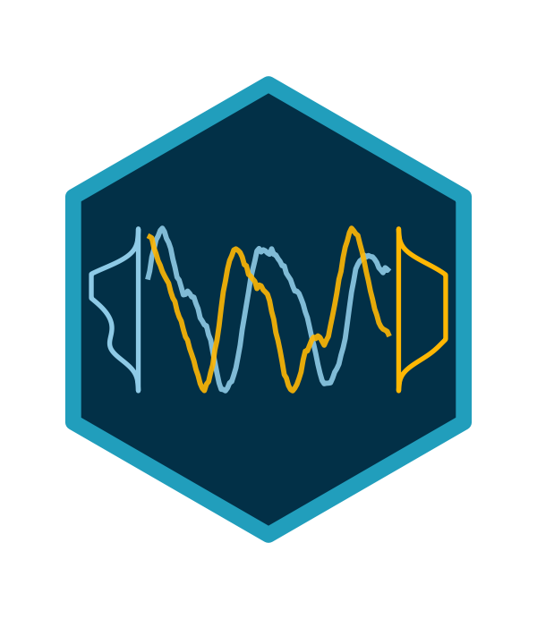

# dcvar: Dynamic Copula VAR Models for Time-Varying Dependence

[](https://github.com/benlug/dcvar)

<!-- badges: start -->
[](https://github.com/benlug/dcvar/actions/workflows/R-CMD-check.yaml)
[](https://lifecycle.r-lib.org/articles/stages.html#experimental)
[](https://www.gnu.org/licenses/gpl-3.0.en.html)
<!-- badges: end -->

dcvar fits Bayesian copula vector autoregressions of order one for bivariate
time series. The modelling idea is to keep two questions separate: how each
series is distributed on its own, and how the two series move together. A
copula carries the dependence, so each margin may follow its own distribution
while a single association parameter describes how the series are coupled at a
given time.

The conditional mean follows a first-order vector autoregression, so each
series depends on the recent past of both. The innovations are joined by a
Gaussian copula, with a Clayton copula also available for the constant
baseline. The association can be held constant, allowed to drift smoothly as a
random walk, allowed to switch between latent regimes, or expressed as a
function of covariates. In the dynamic model the autoregressive coefficients
and the innovation scales may vary over time as well. Everything is estimated
in a fully Bayesian way through [Stan](https://mc-stan.org/), which returns
posterior distributions for all quantities.

Two further families, a multilevel version for panel data and a
structural-equation version for latent processes, are provided as experimental
extensions.

## Installation

dcvar uses [`rstan`](https://mc-stan.org/rstan/) as its default backend.

Install dcvar from CRAN:

```r
install.packages("dcvar")
```

For the development version:

```r
install.packages("remotes")
remotes::install_github("benlug/dcvar")
```

Optionally, you can use [`cmdstanr`](https://mc-stan.org/cmdstanr/) as an
alternative backend:

```r
install.packages(
  "cmdstanr",
  repos = c("https://stan-dev.r-universe.dev", getOption("repos"))
)
cmdstanr::install_cmdstan()
```

For skew-normal margins, install `sn`:

```r
install.packages("sn")
```

## Example

The example below simulates a bivariate series whose association declines over
time, fits the dynamic copula model, and compares it with the regime-switching
and constant-association alternatives by cross-validation.

```r
library(dcvar)

# simulate data with decreasing coupling
sim <- simulate_dcvar(
  n_time = 150,
  rho_trajectory = rho_decreasing(150, rho_start = 0.7, rho_end = 0.3)
)

# fit the DC-VAR model
fit <- dcvar(sim$Y_df, vars = c("y1", "y2"))

# inspect results
summary(fit)
plot_rho(fit, true_rho = sim$true_params$rho)

# compare models via leave-one-out cross-validation
fit_hmm <- dcvar_hmm(sim$Y_df, vars = c("y1", "y2"), K = 2)
fit_con <- dcvar_constant(sim$Y_df, vars = c("y1", "y2"))
dcvar_compare(dcvar = fit, hmm = fit_hmm, constant = fit_con)
```

## Models

The models differ only in how the association between the two series behaves
over time. The marginal model and the vector-autoregressive mean are shared.

| Model | Function | Association over time | Status |
| --- | --- | --- | --- |
| DC-VAR | `dcvar()` | Drifts smoothly as a random walk on the Fisher z scale; the autoregressive coefficients and innovation scales may also drift | Core |
| HMM Copula | `dcvar_hmm()` | Switches between K latent regimes | Core |
| Constant Copula | `dcvar_constant()` | Held constant (Gaussian or Clayton) | Core |
| Covariate DC-VAR | `dcvar_covariate()` | A function of observed covariates on the Fisher z scale | Core |
| Multilevel | `dcvar_multilevel()` | Series-specific autoregressive coefficients across many units | Experimental |
| SEM | `dcvar_sem()` | Latent processes measured by observed indicators | Experimental |

Because the copula keeps the margins separate from the dependence, every model
accepts per-variable margins. Pass a length-two vector such as
`margins = c("normal", "exponential")` to let each series follow a different
marginal family. The single-level models `dcvar()`, `dcvar_hmm()`, and
`dcvar_constant()` with a Gaussian copula support all four families (normal,
exponential, skew-normal, and gamma), used on their own or in combination.
`dcvar_multilevel()` and `dcvar_sem()` support normal and exponential margins
as a single family, and all four families in combination.
`dcvar_constant(copula = "clayton")` provides a Clayton-copula baseline with
normal or mixed margins.

In `dcvar()`, the association always evolves over time. Setting `tv_phi = TRUE`
additionally lets the autoregressive coefficients drift as random walks, and
`tv_sigma = TRUE` lets the innovation scales drift. `tv_phi` also accepts
`"ar"` or `"cross"` to let only the autoregressive or only the cross-lagged
coefficients vary. With both options off, the model reduces to the
constant-coefficient dynamic copula.

## Estimation and checks

Fitted and one-step-ahead predicted values are available for every fitted
model. For multilevel fits these are specific to each unit; for
structural-equation fits they cover both the latent states (`type = "link"`)
and the observed indicators (`type = "response"`).

Leave-one-out cross-validation through `loo()` is available for the
single-level fits, the covariate fits, the multilevel fits, and the naive
structural-equation score fits, and `dcvar_compare()` places several fits on a
common predictive scale. Comparisons that mix model families whose pointwise
predictive densities are not on the same footing are flagged with a warning.

Residual checks based on the probability integral transform, `pit_values()` and
`pit_test()`, are provided for the single-level models. They use posterior
means and are best read as heuristic checks rather than exact calibration
tests. Posterior predictive checks through `plot_ppc()` are available for
normal and exponential margins; gamma and skew-normal fits do not yet store
replicated residuals on the observed margin scale.

The package also includes a constant Clayton-copula baseline, a multilevel
model with exponential margins, and naive structural-equation score models that
were used in the accompanying simulation studies.

## Documentation

- Getting started vignette: [vignettes/getting-started.Rmd](vignettes/getting-started.Rmd)
- Model comparison vignette: [vignettes/model-comparison.Rmd](vignettes/model-comparison.Rmd)
- Simulation tools vignette: [vignettes/simulation-tools.Rmd](vignettes/simulation-tools.Rmd)
- Full Quarto walkthrough: [vignettes/dcvar-walkthrough.qmd](https://github.com/benlug/dcvar/blob/main/vignettes/dcvar-walkthrough.qmd)
- Source code and issue tracker: <https://github.com/benlug/dcvar>

## Citation

If you use dcvar in your work, cite it with:

```r
citation("dcvar")
```

## Getting Help

- Report bugs or request features at <https://github.com/benlug/dcvar/issues>
- For usage questions, include a minimal reproducible example when possible
